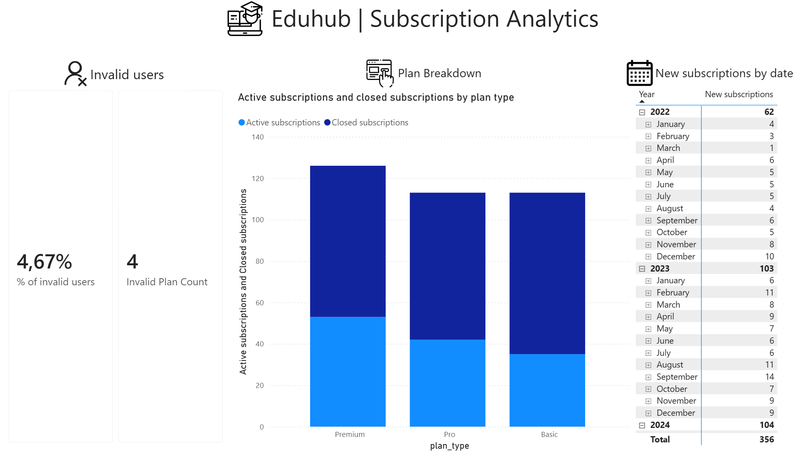
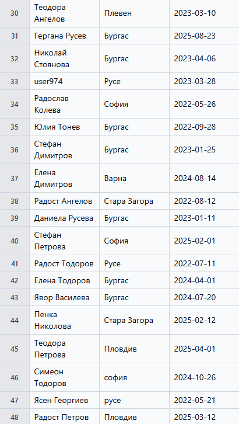
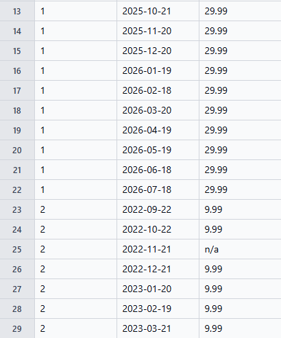
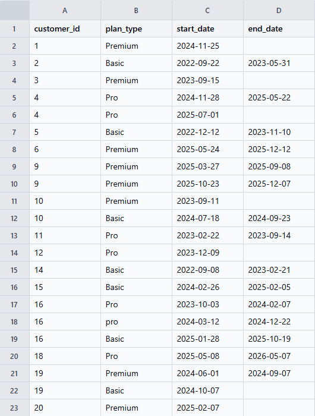

# 🎓 EduHub Subscription Analytics
Cleaning and validating data from an EdTech subscription service — from raw data to business insights.


## 📂About the data
The data has been synthetically generated and contains pre-defined issues.
It consists of three related tables:
[You could include a diagram showing which columns the relationships are based on]
1 – Customers with names (where there was invalid data), signup date and their locations



2 – A table of payments showing dates, subscription IDs and amounts



3 – A table containing subscription details, including subscription type, start and end dates, and customer IDs



I selected the analytical logic, methods for identifying incorrect data and working procedures myself; I was not aware of the specific issues present there

## 📋Task
A technical specification was drawn up with the following requirements:
- Data cleansing/validation (in Python)
- Data loading and validation in PostgreSQL
- Creation of a dashboard in Power BI that answered the following questions:
   - Seasonality of subscriptions
   - Number of active and closed subscriptions by plan
   - Number of invalid plans and users
   
## 🛠️Methods
###  Python
To begin with, the tables and their contents were checked to identify exactly what problems they contained.
After that, various methods were used depending on the specific issues.
For example:
- The case of the names was in itself an indicator of validity – if everything were converted to a single case, this indicator would be lost
```
mask_blacklist_cus = customers_raw['full_name'].str.contains(r'\d')
pattern_cus = ~customers_raw['full_name'].str.contains(r'^[А-ЯЁ][а-яё]+ [А-ЯЁ][а-яё]+$', regex=True)
general_mask_customers = mask_blacklist_cus | pattern_cus
customers_raw['is_valid_name'] = np.where(general_mask_customers, False, True)
customers_raw['full_name'] = customers_raw['full_name'].str.strip()
```

- The city field does not contain any information regarding validity, so it was normalised

`customers_raw['city'] = customers_raw['city'].str.strip().str.lower()`
- To identify customers who had been recorded multiple times under different IDs, their name, registration date and city were used, as the issue in question was customers recorded multiple times under different IDs; if the ID had been included in the deduplication key, the result would have been zero
- Anti-join: first, subscriptions without a customer ID were identified, then payments without a subscription ID
```
orphaned = subscriptions_raw[~subscriptions_raw['customer_id'].isin(customers_raw['customer_id'])]
subscriptions_raw = subscriptions_raw.drop(orphaned.index)
orph_rows = payments_raw[~payments_raw['subscription_id'].isin(subscriptions_raw['subscription_id'])]
payments_raw = payments_raw.drop(orph_rows.index)

```
This precisely reflects the structure of the tables themselves
customers -> subscriptions -> payments
- Typos in `plan_type` were found and corrected using value counts

###  SQL

Following final validation, the cleaned-up tables were loaded back into the database.
Additional checks were carried out using PostgreSQL queries to verify the results.
Four invalid subscriptions were identified separately (see the next sub-section)
- Checking for duplicate lines
```
SELECT * FROM
	(SELECT customers_clean.customer_id,
	ROW_NUMBER() OVER (PARTITION BY full_name, signup_date ORDER BY customer_id) as rnk
	FROM customers_clean
	WHERE is_valid_name = true) AS sub
WHERE sub.rnk !=1
```
- JOIN all tables and top 10 users by amount
``` 
SELECT cus.customer_id, SUM(pay.amount) as total_s
FROM subscriptions_clean AS sub
JOIN customers_clean AS cus ON sub.customer_id = cus.customer_id
JOIN payments_clean AS pay ON sub.subscription_id = pay.subscription_id
GROUP BY cus.customer_id
ORDER BY total_s DESC
LIMIT 10
```
- Customers with no currently active subscription (churn risk)
```
SELECT customer_id
FROM subscriptions_clean
GROUP BY customer_id
HAVING COUNT(*)=COUNT(end_date)
```
###  Power BI
Tables were imported into Power BI from the PostgreSQL database
- #### Invalid users and subscription invalid count
To count invalid subscriptions, a measure was created using the ‘valid_plans’ column
```
Invalid Plan Count = CALCULATE(COUNTROWS('public subscriptions_clean'), 'public subscriptions_clean'[valid_plans] = FALSE())
```
To calculate the percentage of invalid users, the ‘is_valid_name’ column was used, divided by the total count (via COUNTROWS)
```
all_cus = COUNTROWS('public customers_clean')
```
```
% of invalid users = DIVIDE([invalid_cus], [all_cus])
```
- #### Active and inactive subscriptions
- The absence of a date in the ‘end_date’ field indicates that a subscription is active. This was calculated using COUNTROWS + ISBLANK (for active subscriptions) and COUNTROWS + NOT ISBLANK (for inactive subscriptions) 
```
Active subscriptions = CALCULATE(COUNTROWS('public subscriptions_clean'), ISBLANK('public subscriptions_clean'[end_date]))
```
```
Closed subscriptions = CALCULATE(COUNTROWS('public subscriptions_clean'), NOT(ISBLANK('public subscriptions_clean'[end_date])))
```
- #### New subscriptions by date
 To do this, I needed to create a helper ‘calendar’ table 
```
Calendar = CALENDAR(
    MIN(
        MIN('public subscriptions_clean'[start_date]),
        MIN(
            MIN('public subscriptions_clean'[end_date]),
            MIN(
                MIN('public customers_clean'[signup_date]),
                MIN('public payments_clean'[payment_date])
            )
        )
    ),
    MAX(
        MAX('public subscriptions_clean'[start_date]),
        MAX(
            MAX('public subscriptions_clean'[end_date]),
            MAX(
                MAX('public customers_clean'[signup_date]),
                MAX('public payments_clean'[payment_date])
            )
        )
    )
)
```
In addition, three extra columns were extracted from 
the calendar: day, month and year, plus a helper ‘MonthNo’ column to sort the months by calendar rather than alphabetically
```
Day = DAY('Calendar'[Date])
Month = FORMAT('Calendar'[Date], "MMMM", "en-US")
MonthNo = MONTH('Calendar'[Date])
Year = YEAR('Calendar'[Date])
```

